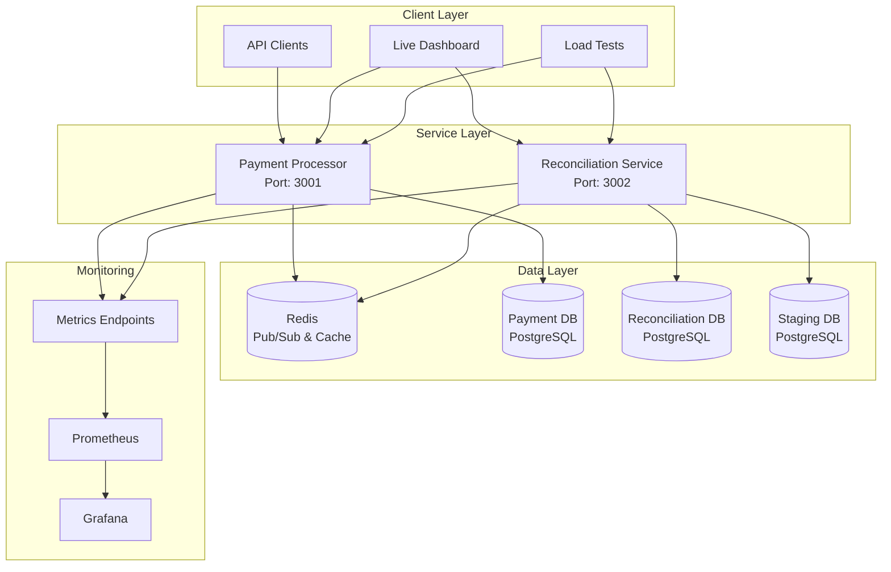
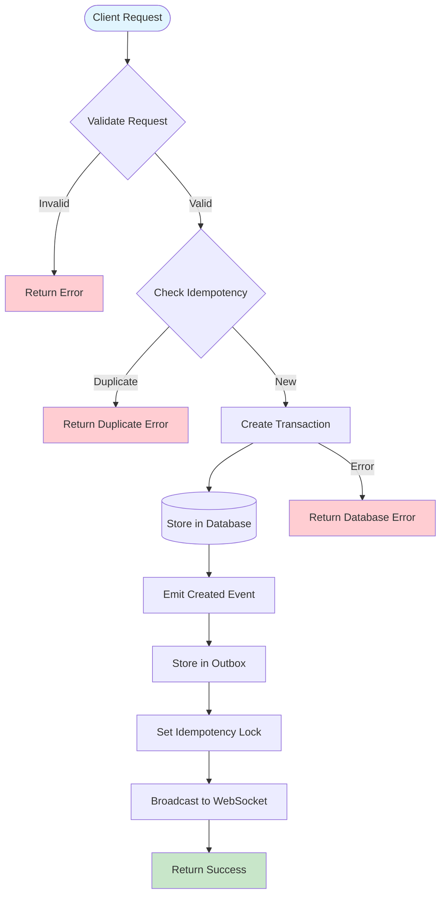
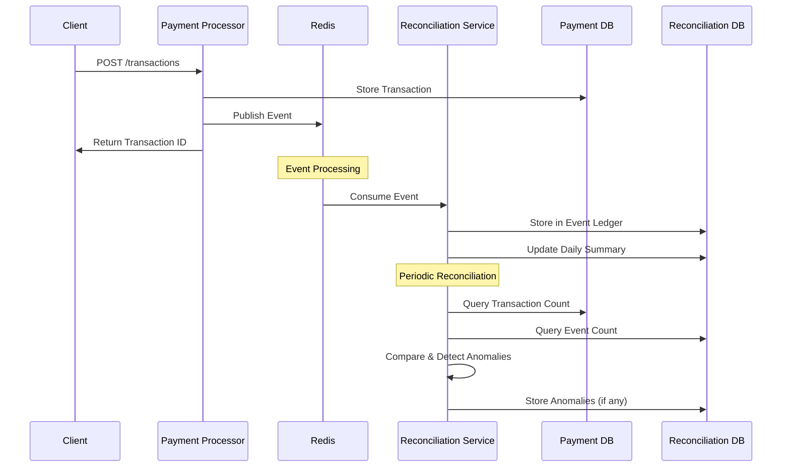
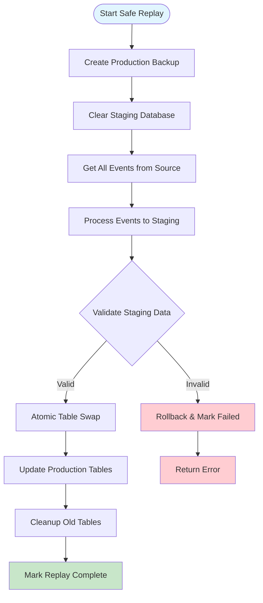
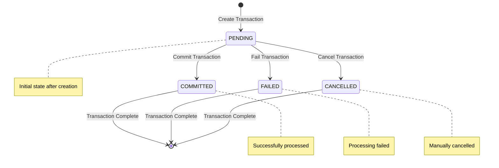
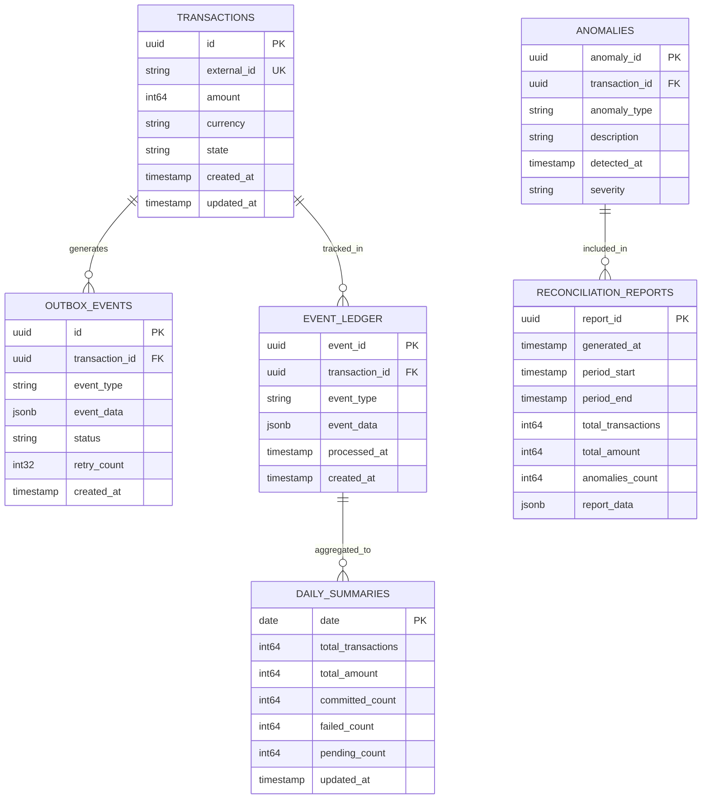
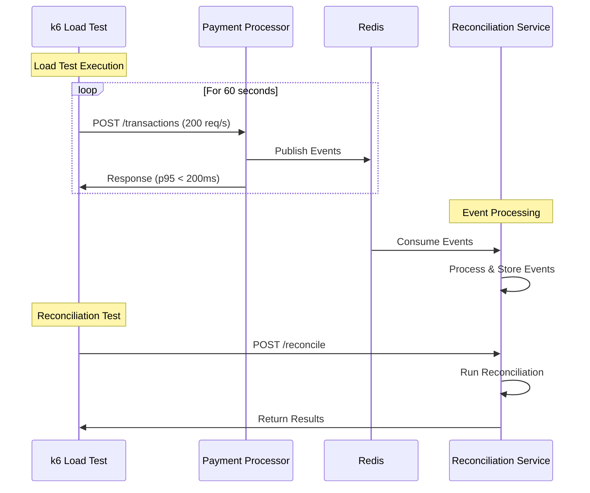
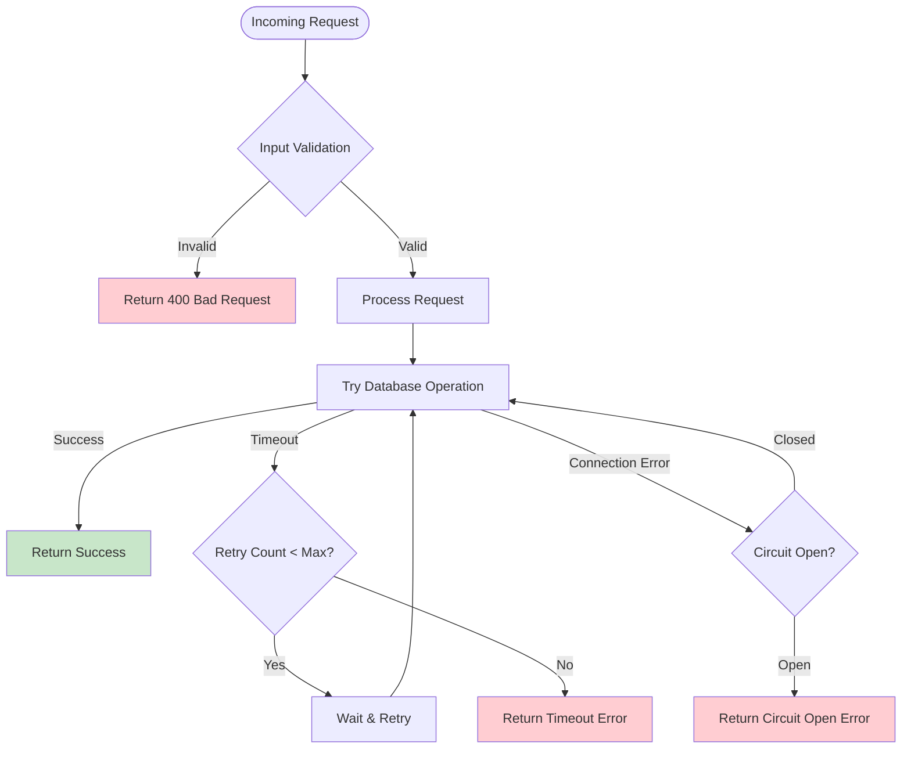
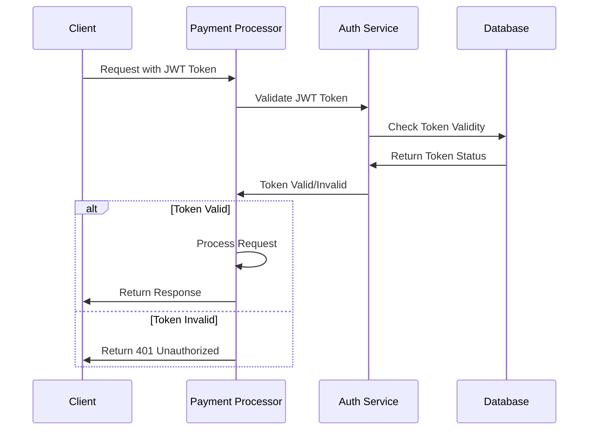

# DFSP-Lite Payments & Reconciliation Mini-Platform

A production-style, two-service mini-platform simulating a Digital Financial Services Provider (DFSP) gateway built with Rust.

## Overview

This project demonstrates microservices architecture, message-driven design, and resilience patterns within a distributed system. It consists of two independent services that collaborate through an event-driven workflow to handle payment processing and reconciliation.

## Architecture

```
┌─────────────────────┐    ┌─────────────────────┐    ┌─────────────────────┐
│   Payment Processor │    │   Redis (Events)   │    │ Reconciliation &   │
│   (Service A)       │◄──►│   (Pub/Sub)        │◄──►│   Reporting        │
│   Port: 3001        │    │   Port: 6379       │    │   (Service B)       │
└─────────────────────┘    └─────────────────────┘    │   Port: 3002        │
         │                                           └─────────────────────┘
         ▼                                                    │
┌─────────────────────┐                                      ▼
│   PostgreSQL        │                              ┌─────────────────────┐
│   (Payment DB)      │                              │   PostgreSQL        │
│   Port: 5432        │                              │   (Reconciliation)  │
└─────────────────────┘                              │   Port: 5433        │
                                                     └─────────────────────┘
```

## System Flow Diagrams

### 1. High-Level System Architecture



### 2. Transaction Processing Flow



### 3. Event-Driven Reconciliation Flow



### 4. Safe Event Replay Process



### 5. State Machine Flow



### 6. Database Schema Relationships



### 7. Monitoring & Observability Stack

```mermaid
graph TB
    subgraph "Application Layer"
        PP[Payment Processor]
        RS[Reconciliation Service]
    end
    
    subgraph "Metrics Collection"
        PP --> PP_Metrics[/metrics endpoint]
        RS --> RS_Metrics[/metrics endpoint]
    end
    
    subgraph "Monitoring Stack"
        PP_Metrics --> Prometheus[Prometheus<br/>Metrics Storage]
        RS_Metrics --> Prometheus
        Prometheus --> Grafana[Grafana<br/>Visualization]
    end
    
    subgraph "Health Monitoring"
        PP --> PP_Health[/health endpoint]
        RS --> RS_Health[/health endpoint]
    end
    
    subgraph "Logging"
        PP --> PP_Logs[Structured Logs]
        RS --> RS_Logs[Structured Logs]
    end
    
    style Prometheus fill:#e3f2fd
    style Grafana fill:#f3e5f5
```

### 8. Load Testing Flow



### 9. Error Handling & Resilience Patterns



### 10. Security & Authentication Flow



## Services

### Service A - Payment Processor
- **Port**: 3001
- **Database**: PostgreSQL (port 5432)
- **Responsibilities**:
  - Multi-format input ingestion (JSON, ISO-8583-like)
  - Transaction state machine (PENDING → COMMITTED → FAILED)
  - Idempotency enforcement using Redis locks
  - Event publishing for state changes
  - JWT-based authentication

### Service B - Reconciliation & Reporting
- **Port**: 3002
- **Database**: PostgreSQL (port 5433)
- **Responsibilities**:
  - Event consumption from Payment Processor
  - Event-sourced ledger maintenance
  - Periodic reconciliation with transaction store
  - Anomaly detection and recording
  - Daily report generation (CSV format)

## Quick Start

### Prerequisites
- Docker and Docker Compose
- Rust 1.75+ (for local development)
- k6 (for load testing)

### Running with Docker Compose

1. **Clone and start services**:
   ```bash
   git clone <repository-url>
   cd dfsp-lite-payments
   docker-compose up -d
   ```

2. **Verify services are running**:
   ```bash
   # Check Payment Processor health
   curl http://localhost:3001/health
   
   # Check Reconciliation Service health
   curl http://localhost:3002/health
   ```

3. **Run load tests**:
   ```bash
   # Install k6 if not already installed
   # Windows: choco install k6
   # macOS: brew install k6
   # Linux: apt-get install k6
   
   # Run payment processor load test
   k6 run load-tests/load-test.js
   
   # Run reconciliation service load test
   k6 run load-tests/reconciliation-test.js
   ```

4. **Access the Live Dashboard**:
   ```bash
   # Open the dashboard in your browser
   open dashboard/index.html
   # Or navigate to: file:///path/to/dashboard/index.html
   ```

5. **View Prometheus Metrics**:
   ```bash
   # Payment Processor metrics
   curl http://localhost:3001/metrics
   
   # Reconciliation Service metrics
   curl http://localhost:3002/metrics
   
   # Prometheus UI (if running)
   open http://localhost:9090
   ```

### Local Development

1. **Start dependencies**:
   ```bash
   docker-compose up -d payment-db reconciliation-db redis
   ```

2. **Run migrations**:
   ```bash
   # Payment Processor DB
   psql -h localhost -p 5432 -U postgres -d payment_processor -f migrations/001_payment_processor_schema.sql
   
   # Reconciliation DB
   psql -h localhost -p 5433 -U postgres -d reconciliation -f migrations/002_reconciliation_schema.sql
   ```

3. **Build and run services**:
   ```bash
   # Build all services
   cargo build --release
   
   # Run Payment Processor
   cd payment-processor
   cargo run
   
   # Run Reconciliation Service (in another terminal)
   cd reconciliation-service
   cargo run
   ```

## API Documentation

### Payment Processor API (Port 3001)

#### Create Transaction
```http
POST /transactions
Content-Type: application/json

{
  "external_id": "unique-external-id",
  "amount": 10000,
  "currency": "USD",
  "from_account": "account-123",
  "to_account": "account-456",
  "description": "Payment description",
  "metadata": {
    "key": "value"
  }
}
```

#### Get Transaction
```http
GET /transactions/{transaction-id}
```

#### Update Transaction State
```http
POST /transactions/{transaction-id}/commit
POST /transactions/{transaction-id}/fail
POST /transactions/{transaction-id}/cancel
```

#### List Transactions
```http
GET /transactions?state=PENDING&limit=100&offset=0
```

### Reconciliation Service API (Port 3002)

#### Generate Report
```http
POST /reports/generate
Content-Type: application/json

{
  "period_start": "2024-01-01T00:00:00Z",
  "period_end": "2024-01-02T00:00:00Z"
}
```

#### List Reports
```http
GET /reports?limit=50&offset=0
```

#### Download Report (CSV)
```http
GET /reports/{report-id}/download
```

#### List Anomalies
```http
GET /anomalies?severity=HIGH&limit=100&offset=0
```

#### Trigger Reconciliation
```http
POST /reconcile
```

## Performance Requirements

- **Throughput**: 200 transactions per second for 60 seconds
- **Latency**: p95 < 200ms
- **Error Rate**: < 1%
- **Idempotency**: Duplicate requests handled correctly
- **Resilience**: Timeout, retry, circuit-breaker patterns

## Database Design

### Payment Processor Schema
- **Primary Index**: `idx_transactions_external_id` on `external_id` (most frequent query)
- **Performance Index**: `idx_transactions_state_created_at` for reconciliation queries
- **Optimization**: Composite index for state + time queries

### Reconciliation Schema
- **Event Ledger**: Event-sourced storage with transaction-based indexing
- **Reports**: Time-based partitioning for efficient report generation
- **Anomalies**: Severity-based indexing for quick anomaly retrieval

## Security

- **JWT Authentication**: Self-issued tokens for critical operations
- **Input Validation**: Comprehensive validation for all API inputs
- **SQL Injection Protection**: Parameterized queries using SQLx
- **Rate Limiting**: Redis-based rate limiting (can be added)

## Monitoring & Observability

- **Health Checks**: `/health` endpoints for both services
- **Structured Logging**: JSON-formatted logs with tracing
- **Metrics**: Request/response metrics (Prometheus-ready)
- **Distributed Tracing**: Request correlation across services

## Load Testing Results

Run the included k6 tests to verify performance requirements:

```bash
# Payment Processor Load Test
k6 run load-tests/load-test.js

# Reconciliation Service Load Test  
k6 run load-tests/reconciliation-test.js
```

Expected results:
- ✅ P95 Latency < 200ms
- ✅ Error Rate < 1%
- ✅ Target Throughput: 200+ req/s

## Project Structure

```
dfsp-lite-payments/
├── Cargo.toml                 # Workspace configuration
├── docker-compose.yml         # Docker services
├── migrations/                # Database schemas
│   ├── 001_payment_processor_schema.sql
│   └── 002_reconciliation_schema.sql
├── load-tests/               # k6 load tests
│   ├── load-test.js
│   └── reconciliation-test.js
├── shared/                   # Common types and utilities
│   ├── Cargo.toml
│   └── src/lib.rs
├── payment-processor/        # Service A
│   ├── Cargo.toml
│   └── src/
│       ├── main.rs
│       ├── auth.rs
│       ├── database.rs
│       ├── redis_client.rs
│       └── state_machine.rs
├── reconciliation-service/   # Service B
│   ├── Cargo.toml
│   └── src/
│       ├── main.rs
│       ├── database.rs
│       ├── redis_client.rs
│       └── reconciliation.rs
└── Dockerfile.*              # Service-specific Dockerfiles
```

## Development Guidelines

### Code Quality
- **Rust Best Practices**: Follow Rust idioms and conventions
- **Error Handling**: Use `anyhow` and `thiserror` for robust error handling
- **Testing**: Unit tests for business logic, integration tests for APIs
- **Documentation**: Comprehensive inline documentation

### Architecture Principles
- **Separation of Concerns**: Clear service boundaries
- **Event-Driven Design**: Loose coupling through events
- **Resilience Patterns**: Timeout, retry, circuit-breaker
- **Data Consistency**: Eventual consistency with reconciliation

## Troubleshooting

### Common Issues

1. **Database Connection Errors**:
   ```bash
   # Check if databases are running
   docker-compose ps
   
   # Check database logs
   docker-compose logs payment-db
   docker-compose logs reconciliation-db
   ```

2. **Redis Connection Issues**:
   ```bash
   # Test Redis connection
   redis-cli -h localhost -p 6379 ping
   ```

3. **Service Health Checks**:
   ```bash
   # Check service health
   curl http://localhost:3001/health
   curl http://localhost:3002/health
   ```

### Performance Tuning

1. **Database Optimization**:
   - Monitor query performance
   - Adjust connection pool sizes
   - Optimize indexes based on query patterns

2. **Redis Optimization**:
   - Monitor memory usage
   - Configure appropriate TTL values
   - Use Redis clustering for scale

## ✅ Completed Stretch Goals

- **✅ Outbox Pattern**: Transactional event publishing implemented with retry logic
- **✅ Event Replay**: Complete ledger reconstruction capability with progress tracking
- **✅ Prometheus + Grafana**: Comprehensive metrics collection and visualization
- **✅ Live Dashboard**: Real-time transaction monitoring with WebSocket support

## Future Enhancements

- **Kubernetes Deployment**: Production-ready orchestration
- **Advanced Analytics**: Machine learning-based anomaly detection
- **Multi-Region Support**: Geographic distribution and failover
- **API Rate Limiting**: Advanced rate limiting with Redis
- **Audit Logging**: Comprehensive audit trail with encryption

## License

This project is licensed under the MIT License - see the LICENSE file for details.


# Lite-Payment-Processor
