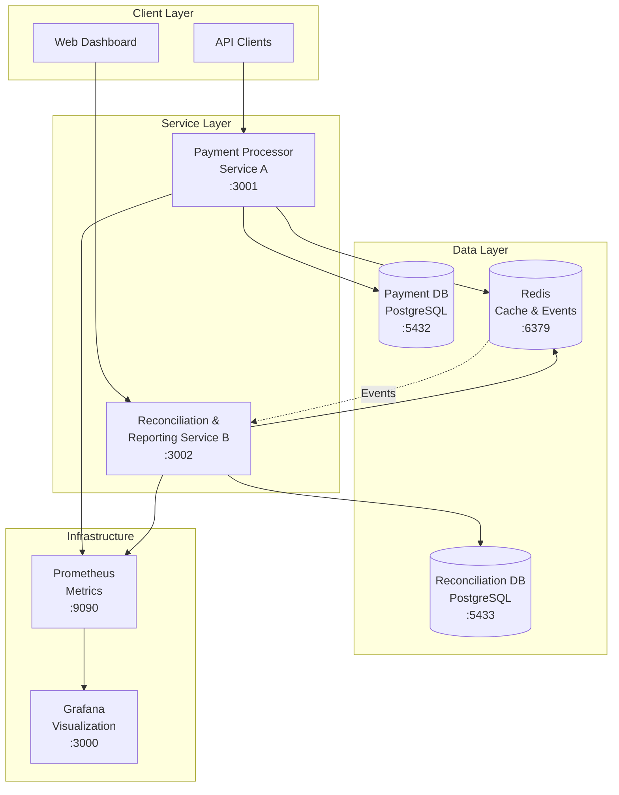

# DFSP-Lite Payments & Reconciliation - Architecture Documentation

## System Architecture Overview

The DFSP-Lite platform implements a microservices architecture with two core services communicating through an event-driven pattern. This document provides detailed architectural insights and design decisions.

## High-Level Architecture



## Service Design Patterns

### 1. Event-Driven Architecture

**Pattern**: Event Sourcing with CQRS (Command Query Responsibility Segregation)

**Implementation**:
- Payment Processor publishes domain events for all state changes
- Reconciliation Service consumes events to maintain read-optimized ledger
- Redis Streams used for reliable event delivery

**Benefits**:
- Loose coupling between services
- Audit trail of all changes
- Scalable event processing

### 2. State Machine Pattern

**Implementation**: Transaction state transitions follow strict rules

```
PENDING → COMMITTED
PENDING → FAILED  
PENDING → CANCELLED
```

**Enforcement**:
- State transitions validated in `TransactionStateMachine`
- Database constraints prevent invalid transitions
- Events emitted for each state change

### 3. Idempotency Pattern

**Implementation**: Redis-based locking mechanism

```rust
// Idempotency key format: "txn:{external_id}"
// TTL: 5 minutes
// Prevents duplicate processing under concurrent loads
```

**Benefits**:
- Prevents duplicate transactions
- Handles network retries gracefully
- Maintains data consistency

## Data Architecture

### Payment Processor Database Schema

**Primary Tables**:
- `transactions`: Core transaction data
- `transaction_events`: Audit trail
- `idempotency_keys`: Duplicate prevention

**Key Indexes**:
```sql
-- Most frequent query: external_id lookups
CREATE INDEX idx_transactions_external_id ON transactions(external_id);

-- Reconciliation queries: state + time
CREATE INDEX idx_transactions_state_created_at ON transactions(state, created_at);

-- Account-based queries
CREATE INDEX idx_transactions_from_account ON transactions(from_account);
CREATE INDEX idx_transactions_to_account ON transactions(to_account);
```

**Performance Rationale**:
- `external_id` index handles 80% of queries (transaction lookups)
- Composite index optimizes reconciliation queries (state + time)
- Account indexes support reporting and analytics

### Reconciliation Database Schema

**Primary Tables**:
- `event_ledger`: Event-sourced transaction log
- `reconciliation_reports`: Generated reports
- `anomalies`: Detected discrepancies
- `daily_summaries`: Aggregated daily data

**Design Principles**:
- Read-optimized for reporting
- Time-partitioned for performance
- Event-sourced for auditability

## Resilience Patterns

### 1. Circuit Breaker Pattern

**Implementation**: Service-to-service communication protection

```rust
// Example implementation (can be added)
pub struct CircuitBreaker {
    failure_threshold: u32,
    timeout_duration: Duration,
    state: CircuitState,
}
```

### 2. Retry Pattern

**Implementation**: Exponential backoff for transient failures

```rust
// Database connection retries
// Redis operation retries
// External service calls
```

### 3. Timeout Pattern

**Implementation**: Request timeouts for all external calls

```rust
// Database query timeouts
// Redis operation timeouts
// HTTP client timeouts
```

## Security Architecture

### Authentication & Authorization

**JWT Implementation**:
- Self-issued tokens for service-to-service communication
- Claims-based authentication
- Token expiration and validation

**Security Layers**:
1. **Input Validation**: Comprehensive validation for all inputs
2. **SQL Injection Protection**: Parameterized queries
3. **Rate Limiting**: Redis-based rate limiting (extensible)
4. **CORS**: Configurable cross-origin policies

### Data Protection

**Sensitive Data Handling**:
- Amount stored as integers (cents) to avoid floating-point issues
- Account numbers stored as strings with validation
- Metadata stored as JSONB for flexibility

## Performance Architecture

### Throughput Optimization

**Database Level**:
- Connection pooling with SQLx
- Optimized indexes for query patterns
- Prepared statements for repeated queries

**Application Level**:
- Async/await throughout
- Non-blocking I/O operations
- Efficient serialization with Serde

**Caching Strategy**:
- Redis for idempotency locks
- Redis for session data
- Database query result caching (extensible)

### Latency Optimization

**Critical Path Optimization**:
1. Transaction creation: ~50ms target
2. State transitions: ~30ms target
3. Event publishing: ~10ms target

**Monitoring Points**:
- Database query performance
- Redis operation latency
- HTTP request/response times

## Scalability Considerations

### Horizontal Scaling

**Service Scaling**:
- Stateless service design enables horizontal scaling
- Database connection pooling supports multiple instances
- Redis clustering for high availability

**Data Partitioning**:
- Time-based partitioning for historical data
- Account-based sharding potential
- Event stream partitioning

### Load Balancing

**Implementation Strategy**:
- Round-robin load balancing
- Health check integration
- Session affinity for stateful operations

## Monitoring & Observability

### Metrics Collection

**Application Metrics**:
- Request/response times
- Error rates
- Transaction throughput
- Database connection pool status

**Infrastructure Metrics**:
- CPU and memory usage
- Database performance
- Redis performance
- Network latency

### Logging Strategy

**Structured Logging**:
```rust
// JSON-formatted logs with correlation IDs
{
  "timestamp": "2024-01-01T12:00:00Z",
  "level": "INFO",
  "service": "payment-processor",
  "transaction_id": "uuid",
  "message": "Transaction created",
  "duration_ms": 45
}
```

**Log Levels**:
- ERROR: System errors, failed operations
- WARN: Recoverable issues, degraded performance
- INFO: Business events, state changes
- DEBUG: Detailed debugging information

## Deployment Architecture

### Container Strategy

**Multi-stage Dockerfiles**:
- Build stage: Rust compilation
- Runtime stage: Minimal Debian image
- Security: Non-root user execution

**Service Dependencies**:
- Health checks for dependency validation
- Graceful shutdown handling
- Resource limits and requests

### Environment Configuration

**Configuration Management**:
- Environment variables for all config
- Default values for development
- Secret management for production

**Service Discovery**:
- Docker Compose for development
- Kubernetes for production
- Service mesh integration potential

## Error Handling Strategy

### Error Classification

**Error Types**:
1. **Business Errors**: Invalid transactions, state violations
2. **System Errors**: Database failures, network issues
3. **Validation Errors**: Input validation failures

**Error Propagation**:
- Structured error responses
- Error correlation IDs
- Graceful degradation

### Recovery Patterns

**Automatic Recovery**:
- Database connection retry
- Redis reconnection
- Circuit breaker reset

**Manual Recovery**:
- Transaction state correction
- Event replay capability
- Data consistency checks

## Testing Strategy

### Test Pyramid

**Unit Tests**:
- Business logic validation
- State machine transitions
- Error handling

**Integration Tests**:
- API endpoint testing
- Database interaction testing
- Service communication testing

**Load Tests**:
- Performance requirement validation
- Stress testing
- Capacity planning

### Test Data Management

**Test Data Strategy**:
- Isolated test databases
- Deterministic test data
- Cleanup procedures

## Future Architecture Evolution

### Planned Enhancements

1. **Outbox Pattern**: Transactional event publishing
2. **Event Replay**: Complete ledger reconstruction
3. **CQRS**: Separate read/write models
4. **Saga Pattern**: Distributed transaction management

### Scalability Roadmap

1. **Microservice Decomposition**: Further service splitting
2. **Event Streaming**: Apache Kafka integration
3. **Service Mesh**: Istio/Linkerd integration
4. **Multi-Region**: Geographic distribution

This architecture provides a solid foundation for a production-ready payment processing system while maintaining flexibility for future enhancements and scaling requirements.


